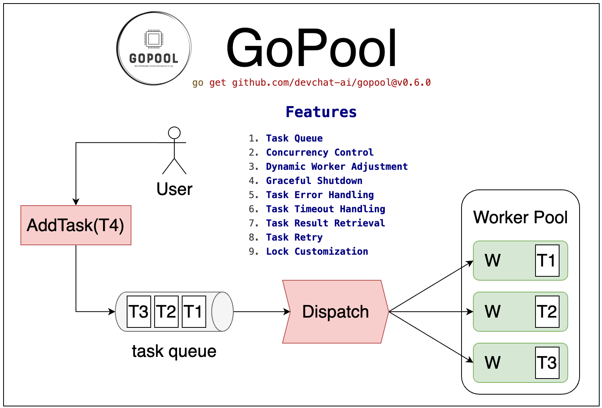

<div align="center">
</br>


# GoPool

[](https://makeapullrequest.com)
[](https://github.com/devchat-ai/gopool/actions)
[](https://goreportcard.com/report/github.com/devchat-ai/gopool)
[](https://github.com/devchat-ai/gopool/releases/)

| English | [中文](README_zh.md) |
| --- | --- |

</div>

Welcome to GoPool, **a project where 95% of the code is generated by GPT**. You can find the corresponding list of Commit and Prompt at [pro.devchat.ai](https://pro.devchat.ai).

GoPool is a high-performance, feature-rich, and easy-to-use worker pool library for Golang. It is designed to manage and recycle a pool of goroutines to complete tasks concurrently, improving the efficiency and performance of your applications.

<div align="center">

</div>

## Features

- [x] **Task Queue**: GoPool uses a thread-safe task queue to store tasks waiting to be processed. Multiple workers can simultaneously fetch tasks from this queue.

- [x] **Concurrency Control**: GoPool can control the number of concurrent tasks to prevent system overload.

- [x] **Dynamic Worker Adjustment**: GoPool can dynamically adjust the number of workers based on the number of tasks and system load.

- [x] **Graceful Shutdown**: GoPool can shut down gracefully. It stops accepting new tasks and waits for all ongoing tasks to complete before shutting down when there are no more tasks or a shutdown signal is received.

- [x] **Task Error Handling**: GoPool can handle errors that occur during task execution.

- [x] **Task Timeout Handling**: GoPool can handle task execution timeouts. If a task is not completed within the specified timeout period, the task is considered failed and a timeout error is returned.

- [x] **Task Result Retrieval**: GoPool provides a way to retrieve task results.

- [x] **Task Retry**: GoPool provides a retry mechanism for failed tasks.

- [x] **Lock Customization**: GoPool supports different types of locks. You can use the built-in `sync.Mutex` or a custom lock such as `spinlock.SpinLock`.

- [ ] **Task Priority**: GoPool supports task priority. Tasks with higher priority are processed first.

## Installation

To install GoPool, use `go get`:

```bash
go get -u github.com/devchat-ai/gopool
```

## Usage

Here is a simple example of how to use GoPool with `sync.Mutex`:

```go
package main

import (
    "sync"
    "time"

    "github.com/devchat-ai/gopool"
)

func main() {
    pool := gopool.NewGoPool(100)
    defer pool.Release()

    for i := 0; i < 1000; i++ {
        pool.AddTask(func() (interface{}, error){
            time.Sleep(10 * time.Millisecond)
            return nil, nil
        })
    }
    pool.Wait()
}
```

And here is how to use GoPool with `spinlock.SpinLock`:

```go
package main

import (
    "time"

    "github.com/daniel-hutao/spinlock"
    "github.com/devchat-ai/gopool"
)

func main() {
    pool := gopool.NewGoPool(100, gopool.WithLock(new(spinlock.SpinLock)))
    defer pool.Release()

    for i := 0; i < 1000; i++ {
        pool.AddTask(func() (interface{}, error){
            time.Sleep(10 * time.Millisecond)
            return nil, nil
        })
    }
    pool.Wait()
}
```

## Dynamic Worker Adjustment

GoPool supports dynamic worker adjustment. This means that the number of workers in the pool can increase or decrease based on the number of tasks in the queue. This feature can be enabled by setting the MinWorkers option when creating the pool.

Here is an example of how to use GoPool with dynamic worker adjustment:

```go
package main

import (
    "time"

    "github.com/devchat-ai/gopool"
)

func main() {
    pool := gopool.NewGoPool(100, gopool.WithMinWorkers(50))
    defer pool.Release()

    for i := 0; i < 1000; i++ {
        pool.AddTask(func() (interface{}, error){
            time.Sleep(10 * time.Millisecond)
            return nil, nil
        })
    }
    pool.Wait()
}
```

In this example, the pool starts with 50 workers. If the number of tasks in the queue exceeds (MaxWorkers - MinWorkers) / 2 + MinWorkers, the pool will add more workers. If the number of tasks in the queue is less than MinWorkers, the pool will remove some workers.

## Task Timeout Handling

GoPool supports task timeout. If a task takes longer than the specified timeout, it will be cancelled. This feature can be enabled by setting the `WithTimeout` option when creating the pool.

Here is an example of how to use GoPool with task timeout:

```go
package main

import (
    "time"

    "github.com/devchat-ai/gopool"
)

func main() {
    pool := gopool.NewGoPool(100, gopool.WithTimeout(1*time.Second))
    defer pool.Release()

    for i := 0; i < 1000; i++ {
        pool.AddTask(func() (interface{}, error) {
            time.Sleep(2 * time.Second)
            return nil, nil
        })
    }
    pool.Wait()
}
```

In this example, the task will be cancelled if it takes longer than 1 second.

## Task Error Handling

GoPool supports task error handling. If a task returns an error, the error callback function will be called. This feature can be enabled by setting the `WithErrorCallback` option when creating the pool.

Here is an example of how to use GoPool with error handling:

```go
package main

import (
    "errors"
    "fmt"

    "github.com/devchat-ai/gopool"
)

func main() {
    pool := gopool.NewGoPool(100, gopool.WithErrorCallback(func(err error) {
        fmt.Println("Task error:", err)
    }))
    defer pool.Release()

    for i := 0; i < 1000; i++ {
        pool.AddTask(func() (interface{}, error) {
            return nil, errors.New("task error")
        })
    }
    pool.Wait()
}
```

In this example, if a task returns an error, the error will be printed to the console.

## Task Result Retrieval

GoPool supports task result retrieval. If a task returns a result, the result callback function will be called. This feature can be enabled by setting the `WithResultCallback` option when creating the pool.

Here is an example of how to use GoPool with task result retrieval:

```go
package main

import (
    "fmt"

    "github.com/devchat-ai/gopool"
)

func main() {
    pool := gopool.NewGoPool(100, gopool.WithResultCallback(func(result interface{}) {
        fmt.Println("Task result:", result)
    }))
    defer pool.Release()

    for i := 0; i < 1000; i++ {
        pool.AddTask(func() (interface{}, error) {
            return "task result", nil
        })
    }
    pool.Wait()
}
```

In this example, if a task returns a result, the result will be printed to the console.

## Task Retry

GoPool supports task retry. If a task fails, it can be retried for a specified number of times. This feature can be enabled by setting the `WithRetryCount` option when creating the pool.

Here is an example of how to use GoPool with task retry:

```go
package main

import (
    "errors"
    "fmt"

    "github.com/devchat-ai/gopool"
)

func main() {
    pool := gopool.NewGoPool(100, gopool.WithRetryCount(3))
    defer pool.Release()

    for i := 0; i < 1000; i++ {
        pool.AddTask(func() (interface{}, error) {
            return nil, errors.New("task error")
        })
    }
    pool.Wait()
}
```

In this example, if a task fails, it will be retried up to 3 times.

## Performance Testing

We have conducted several performance tests to evaluate the efficiency and performance of GoPool. Here are the results:

- **TestGoPoolWithMutex**:

```bash
$ go test -benchmem -run=^$ -bench ^BenchmarkGoPoolWithMutex$ github.com/devchat-ai/gopool

goos: darwin
goarch: arm64
pkg: github.com/devchat-ai/gopool
=== RUN   BenchmarkGoPoolWithMutex
BenchmarkGoPoolWithMutex
BenchmarkGoPoolWithMutex-10            2         803105167 ns/op        17416408 B/op    1017209 allocs/op
PASS
ok      github.com/devchat-ai/gopool    2.586s
```

- **TestGoPoolWithSpinLock**:

```bash
$ go test -benchmem -run=^$ -bench ^BenchmarkGoPoolWithSpinLock$ github.com/devchat-ai/gopool

goos: darwin
goarch: arm64
pkg: github.com/devchat-ai/gopool
=== RUN   BenchmarkGoPoolWithSpinLock
BenchmarkGoPoolWithSpinLock
BenchmarkGoPoolWithSpinLock-10                 2         662952562 ns/op        17327176 B/op    1016087 allocs/op
PASS
ok      github.com/devchat-ai/gopool    2.322s
```

- **BenchmarkGoroutines**: 

```bash
$ go test -benchmem -run=^$ -bench ^BenchmarkGoroutines$ github.com/devchat-ai/gopool

goos: darwin
goarch: arm64
pkg: github.com/devchat-ai/gopool
=== RUN   BenchmarkGoroutines
BenchmarkGoroutines
BenchmarkGoroutines-10                 3         371622847 ns/op        96642458 B/op    2005219 allocs/op
PASS
ok      github.com/devchat-ai/gopool    2.410s
```

Please note that the actual performance may vary depending on the specific use case and system environment.
